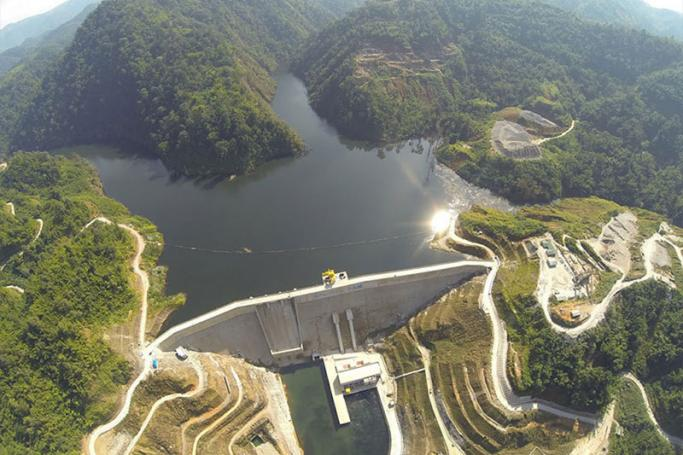
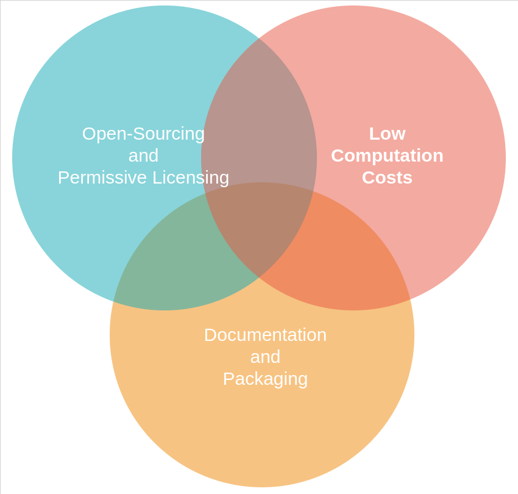
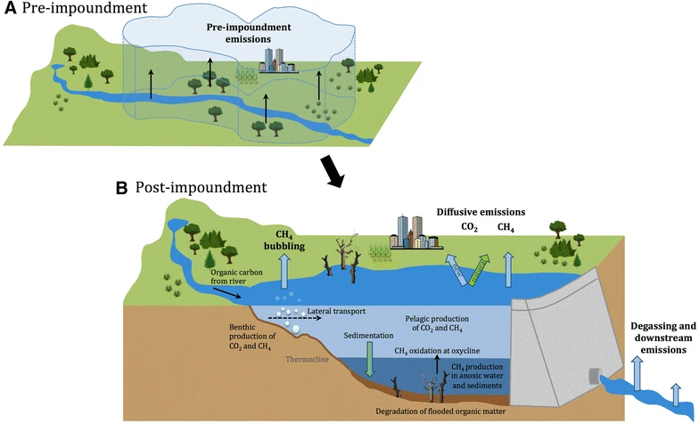
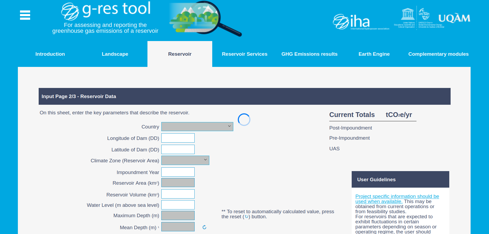
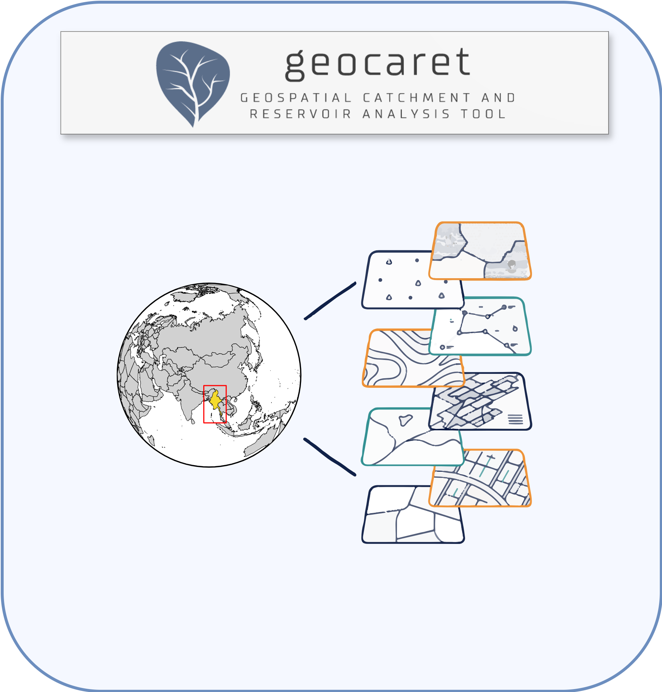
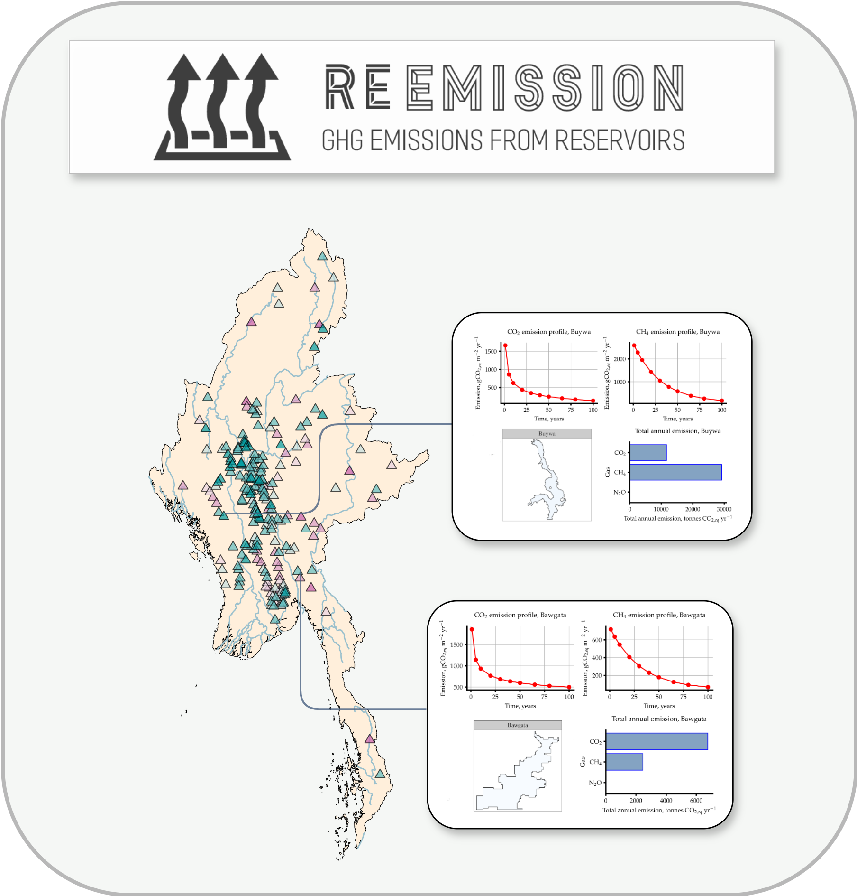
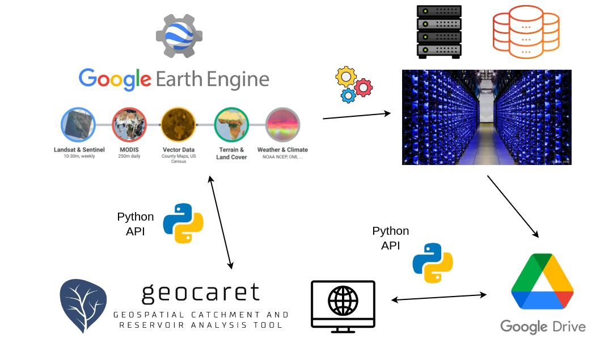
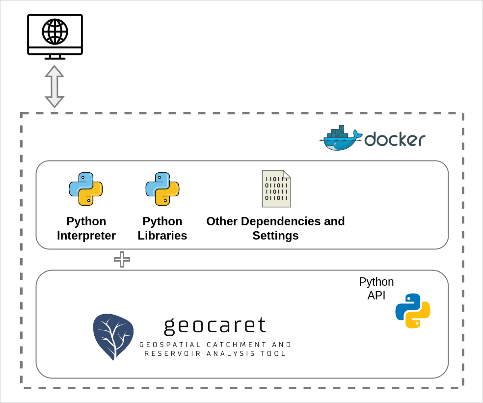
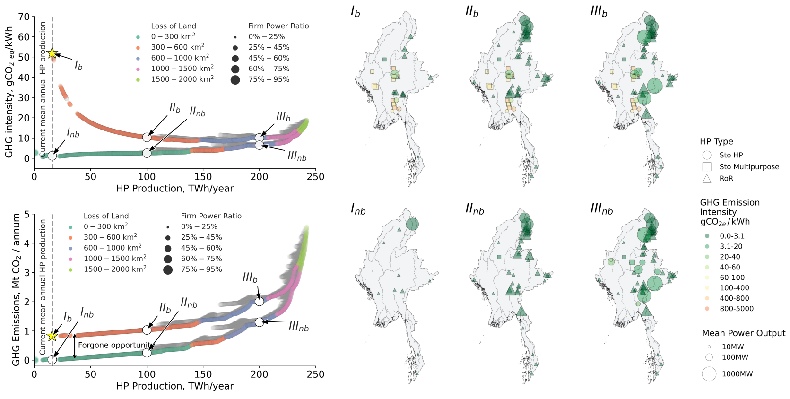
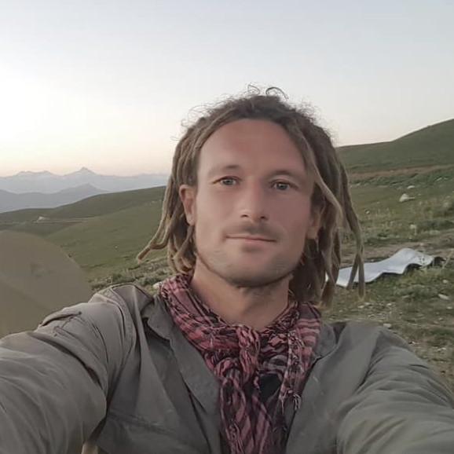

<link rel="stylesheet" href="https://cdn.jsdelivr.net/gh/devicons/devicon@v2.14.0/devicon.min.css">

<!-- .slide: style="text-align: center;"> -->
<h3> Democratizing Reservoir Emission Models via  <i style="color: #FF7A59">Open-Sourcing</i> and <i style="color: #FF7A59">Cloud-Computing</i> </h3>

<h4>Free open tools for <u>large-scale</u> reservoir assessments and planning</h4>

<a href="https://tomjanus.github.io/tyndallassembly24/">https://tomjanus.github.io/tyndallassembly24</a>

---

### Enablers of research software adoption

---

### Reservoir Emissions in a Nutshell

<b>Landscape transformation from a river to a reservoir.</b> Source: Prairie et al. 2018 <em>What Does the Atmosphere See?</em> Ecosystems, 21(5):1058-1071, Aug 2018. URL: <a href="https://doi.org/10.1007/s10021-017-0198-9">https://doi.org/10.1007/s10021-017-0198-9</a>.

---

### Estimating reservoir emissions with g-res

<b>g-res tool.</b> The carbon calculator for reservoirs. URL:  <a href="https://www.grestool.org/">https://www.grestool.org/</a>.

---

## GeoCARET \& RE-Emission
<!-- .slide: style="text-align: center; font-size: 30px"> -->

    

    <!-- Content for the left column goes here -->
    
    

    <a style="font-size:24px" href="https://github.com/Reservoir-Research/geocaret">https://github.com/Reservoir-Research/geocaret</a>

    

    
    

    <a style="font-size:24px" href="https://github.com/tomjanus/reemission">https://github.com/tomjanus/reemission</a>

---

### Outsourcing computation and data storage

---

## Containerising with <i class="devicon-docker-plain-wordmark"></i>
<!-- .slide: data-visibility="hidden" style="text-align: center; font-size: 30px;"> -->

---

<h3>Reservoir Emission<i style="color: #FF7A59"> Assessments</i></h3>

<iframe class="r-stretch" 
style="border-radius: 20px; box-shadow: 15px 15px 35px rgba(180, 180, 180, 0.35);"
src="map.html" frameborder="0" allowfullscreen>
</iframe>

Source: <a href="https://reservoir-research.github.io/ukreservoir-emissions/"> https://reservoir-research.github.io/ukreservoir-emissions/</a>

---

<h3>Reservoir<i style="color: #FF7A59"> Planning</i></h3>

---

### Further Work

<section>
  
1. New applications for <a href="https://github.com/UoMResearchIT/geocaret/">GeoCARET</a>

  
2. Supporting <a href="https://github.com/tomjanus/reemission/">Re-Emission</a> with Interpretations</b>

  
3. Integration with other modelling frameworks

  
4. Engaging with users and stakeholders

</section>

---

## Contributors

<!-- .slide: style="text-align: center; font-size: 30px"> -->

<table>
  <tr>
    <td align="center"> <b>Tomasz Janus</b> (Tyndall) </td>
    <td align="center"> <b>Jaise Kuriakose</b> (Tyndall) </td>
    <td align="center"> <b>Chris Barry</b> (UKCEH) </td>
    <td align="center"> <b>Kamilla Kopec-Harding</b> (Research IT) </td>
    <td align="center"> <b>James Sinnott </b> (Resarch IT) </td>
  </tr>
</table>

 

## Please visit us later for updates

<!--  -->

<a href="https://tomjanus.github.io/tyndallassembly24/">https://tomjanus.github.io/tyndallassembly24</a>
